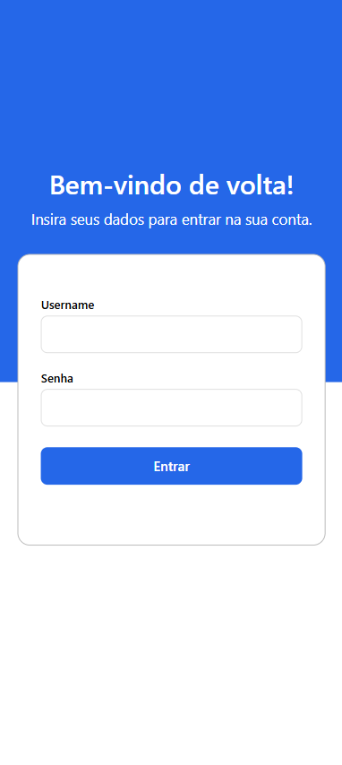
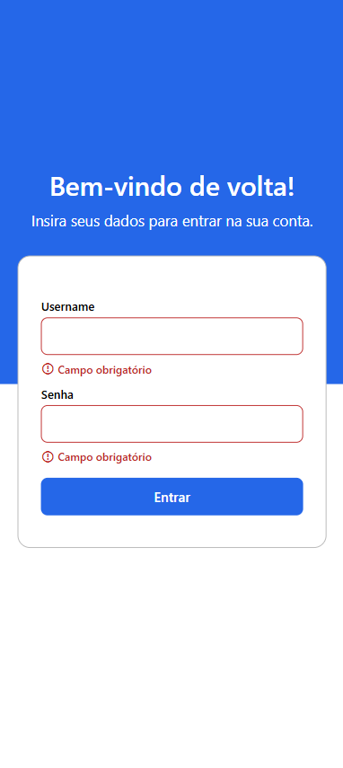
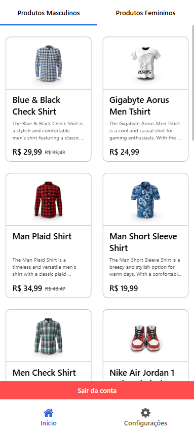
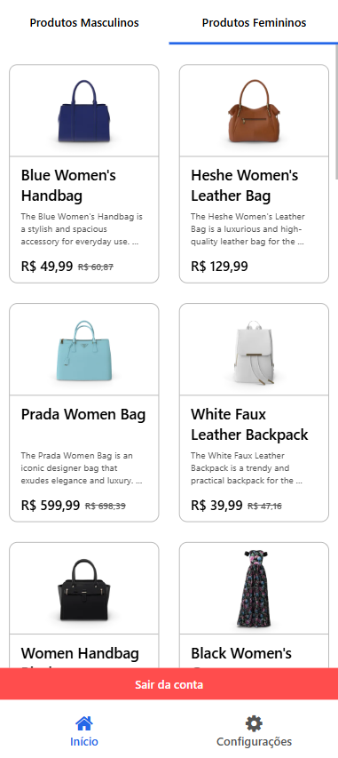
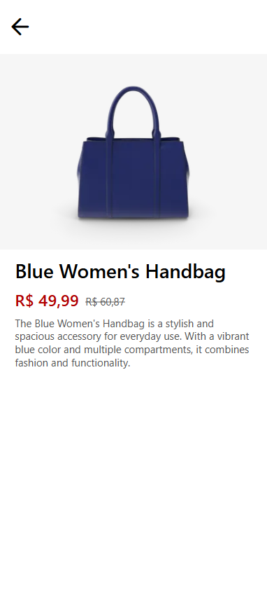

# Catálogo interativo mobile com listagem de produtos por categoria

Este projeto consiste no desenvolvimento de um catálogo de produtos mobile, desenvolvido com React Native, Axios e Redux Toolkit, com foco na listagem de produtos, navegação entre telas e consumo de uma API. A aplicação tem como objetivo disponibilizar uma experiência simples através de uma interface funcional e clara, capaz de exibir a lista de produtos separados por categorias masculina e feminina além da visualização de detalhes ao clicar em cada item. A aplicação também conta com a autenticação do usuário a partir de uma tela de login e botão de logout na página de exibição de produtos.

Este projeto foi desenvolvido como parte da disciplina de Mobile Development e busca demonstrar de forma prática a utilização de tecnologias e conceitos fundamentais do desenvolvimento de aplicações mobile, com foco na organização do código, reutilização de componentes e navegação entre telas.

## Escopo do projeto

Este projeto foi desenvolvido com foco na criação de uma aplicação de catálogo de produtos organizada e funcional, a partir da listagem dividida em categorias, navegação entre telas e consumo de dados a partir de uma API.

Assim entre os principais pontos contemplados durante o desenvolvimento do projeto estão:

- **Integração com uma API externa:/** Utilização de requisições HTTP para buscar os dados dos produtos e categorias e realizar também a autenticação de usuário.
- **Organização da navegação:/** Estruturação das rotas e das telas de forma que o usuário consiga navegar pelo fluxo da aplicação de maneira intuitiva, desde o login, acesso ao catálogo e consulta dos detalhes de um produto.
- **Gerenciamento de estado:/** Utilização do Redux Toolkit para armazenar temporariamente informações importantes para o funcionamento da aplicação, como o estado de autenticação e os dados do produto selecionado.
- **Separação de responsabilidades:/** Organização do projeto em diferentes pastas e arquivos, desde a lógica à estilização, evitando concentrar códigos em único arquivo e facilitando a manutenção.
- **Reutilização de componentes:/** Criação de componentes independentes, como o card de produto, permitindo que a mesma estrutura seja utilizada para diferentes produtos da listagem.
- **Fluxo de logout:/** Implementação de uma ação para encerrar a sessão, limpar os dados armazenados temporariamente no Redux e retornar o usuário para a tela de login.

## Tecnologias utilizadas

Para atender ao escopo e requisitos do projeto, foram utilizadas as seguintes tecnologias e ferramentas:

- **React Native:/** Utilizado para desenvolvimento da interface e dos componentes da aplicação mobile.
- **Axios:/** Utilizado para realizar as requisições HTTP à API tanto para autenticação quanto para o consumo de dados dos produtos.
- **Redux Toolkit:/** Utilizado para gerenciamento do estado global e armazenamento temporário dos dados necessários entre as telas.
- **Expo Router:/** Utilizado para organização das rotas e navegação entre as telas da aplicação.
- **DummyJSON API:/** Utilizada como fonte externa para autenticação e obtenção dos dados dos produtos.

## Instruções para execução do sistema

Para executar a aplicação localmente, é necessário ter o **Node.js** instalado e uma versão atualizada do **npm**.

### 1. Clonar o repositório

No terminal, execute:

```bash
git clone https://github.com/Lais-Cassiano/CatalogoDeProdutos_MobileDevelopment-UniFECAF.git
```

Em seguida, acesse a pasta do projeto:

```bash
cd CatalogoDeProdutos_MobileDevelopment-UniFECAF
```

### 2. Instalar as dependências

Execute o comando:

```bash
npm install
```

Esse comando instala as dependências necessárias para execução da aplicação, de acordo com o arquivo `package.json`.

### 3. Iniciar o projeto

Após a instalação, execute:

```bash
npx expo start
```

O Expo iniciará o servidor de desenvolvimento e disponibilizará as opções para executar a aplicação.

A aplicação pode ser aberta utilizando as opções disponibilizadas pelo Expo, como **Expo Go**, navegador ou emulador compatível.

### 4. Executar pelo navegador

Para testar a aplicação pelo navegador, após executar o comando npx expo start, utilize a opção Web disponibilizada pressionando a tecla w no terminal.

A aplicação será aberta no navegador, para visualizá-la em um formato semelhante ao de um dispositivo mobile, é possível utilizar as ferramentas de desenvolvedor do navegador ou **DevTools/** (apertando `F12` no teclado ou clicando com o botão direito do mouse sobre a página e selecionando `inspecionar`). Já dentro da DevTools basta selecionar um dispositivo em `dimensions` ou ajustar manualmente a dimensão da tela para um formato de smartphone.

### 5. Executar em dispositivo mobile

Também é possível utilizar o Expo Go em um dispositivo compatível, utilizando as opções disponibilizadas pelo Expo após a execução do projeto.

### 6. Acesso à aplicação

Ao iniciar o aplicativo, será apresentada a tela de login. Após realizar a autenticação com credenciais válidas, o usuário terá acesso ao catálogo de produtos.

Para testar o fluxo de autenticação utilizado no projeto, podem ser utilizadas as credenciais de teste disponibilizadas pela API DummyJSON:

```text
Usuário: emilys
Senha: emilyspass
```

Após o login, é possível navegar pelo catálogo, alternar entre as categorias masculina e feminina, selecionar um produto para visualizar seus detalhes e utilizar a opção de logout para retornar à tela de login.

## Estrutura do projeto

A aplicação foi organizada buscando separar as responsabilidades entre navegação, telas, componentes reutilizáveis e estilos. Essa divisão facilita a manutenção do código e permite que cada parte da aplicação tenha uma função específica.

A estrutura principal do projeto é:

- **app/**: Contém as rotas da aplicação e a configuração principal do Expo Router. O arquivo index.tsx funciona como ponto de entrada, direcionando o usuário para a tela de login ou para o catálogo de acordo com o estado de autenticação.

- **app/(stacks)/**: Contém a rota utilizada para acessar a tela de detalhes do produto.

* **src/screens/**: Concentra as telas principais da aplicação. Cada tela possui seu próprio componente e arquivo de estilos, mantendo a lógica de renderização separada da estilização.

- **src/components/**: Contém componentes reutilizáveis como por exemplo o `ProductCard`, que é responsável pela apresentação dos produtos na listagem e recebe os dados necessários por meio requisições a API.

- **src/store/**: Concentra a configuração do Redux Toolkit e os estados globais utilizados pela aplicação.

- **src/store/slices/**: Contém os slices responsáveis pelo gerenciamento dos estados. O `auth-slice` controla o estado de autenticação, enquanto o `product-details-slice` armazena temporariamente os dados do produto selecionado para a tela de detalhes.

Essa organização permite separar a navegação, a apresentação das telas, os componentes reutilizáveis e o gerenciamento de estado, contribuindo para uma estrutura mais organizada e de fácil manutenção.

## Funcionalidades

A aplicação foi desenvolvida contemplando um fluxo completo de utilização, desde a autenticação até a consulta dos produtos e encerramento da sessão.

### Login

A aplicação inicia com uma tela de login, pedindo seu nome de usuário e senha. O formulário realiza a validação dos campos obrigatórios e apresenta mensagens de erro quando os dados não são preenchidos ou quando as credenciais informadas não são aceitas pela API.

Após uma autenticação válida, o usuário é direcionado para o catálogo de produtos.

### Catálogo de produtos

A tela principal apresenta os produtos obtidos por meio da API e permite alternar entre duas abas:

- **Produtos Masculinos**
- **Produtos Femininos**

Os produtos são apresentados em cards organizados, contendo imagem, nome, descrição, preço, e quando aplicável, o preço anterior relacionado a desconto.

### Detalhes do produto

Ao selecionar um produto, o usuário é direcionado para uma tela específica de detalhes. Nessa tela são apresentadas as principais informações do produto:

- Nome;
- Imagem;
- Descrição;
- Preço atual;
- Preço anterior, quando aplicável.

A tela possui uma opção para retornar à listagem de produtos.

### Logout

A aplicação possui um botão para sair da conta e encerrar a sessão. Ao realizar o logout, o estado de autenticação é alterado e os dados do produto armazenados temporariamente no Redux são limpos. O usuário retorna à tela de login e precisa realizar uma nova autenticação para acessar o catálogo.

## Telas da aplicação

A aplicação foi desenvolvida seguindo o fluxo de navegação definido para o projeto, contemplando as etapas de autenticação, consulta dos produtos, visualização dos detalhes e encerramento da sessão.

### Tela de login

A tela inicial que permite que o usuário informe suas credenciais para acessar a aplicação. O formulário possui validação dos campos obrigatórios e apresenta mensagens de erro quando necessário.

<div>
  
  
</div>

### Catálogo de produtos

Tela principal do catálogo acessa após a autenticação. Os produtos são organizados em duas abas, permitindo alternar entre a sessão de produtos masculinos e femininos.

**Produtos masculinos:**



**Produtos femininos:**



### Detalhes do produto

Ao selecionar um produto, a aplicação apresenta uma tela com suas principais informações.



## Licença

- Este projeto está licenciado sob a licença MIT:

Copyright 2026 Lais

Permission is hereby granted, free of charge, to any person obtaining a copy of this software and associated documentation files (the "Software"), to deal in the Software without restriction, including without limitation the rights to use, copy, modify, merge, publish, distribute, sublicense, and/or sell copies of the Software, and to permit persons to whom the Software is furnished to do so, subject to the following conditions:

The above copyright notice and this permission notice shall be included in all copies or substantial portions of the Software.

THE SOFTWARE IS PROVIDED "AS IS", WITHOUT WARRANTY OF ANY KIND, EXPRESS OR IMPLIED, INCLUDING BUT NOT LIMITED TO THE WARRANTIES OF MERCHANTABILITY, FITNESS FOR A PARTICULAR PURPOSE AND NONINFRINGEMENT. IN NO EVENT SHALL THE AUTHORS OR COPYRIGHT HOLDERS BE LIABLE FOR ANY CLAIM, DAMAGES OR OTHER LIABILITY, WHETHER IN AN ACTION OF CONTRACT, TORT OR OTHERWISE, ARISING FROM, OUT OF OR IN CONNECTION WITH THE SOFTWARE OR THE USE OR OTHER DEALINGS IN THE SOFTWARE.
